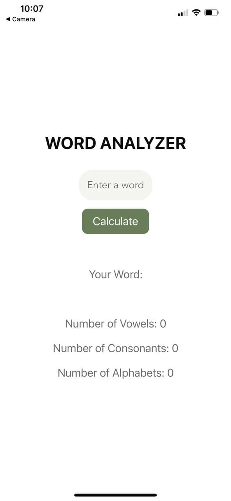
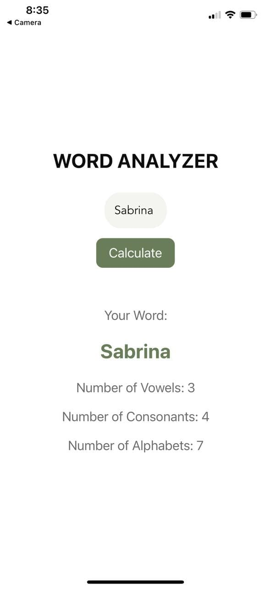

# Word Analyzer
Word Analyzer is a simple React Native mobile application which allows the user to analyze any word input to determine the number of vowels, consonants and alphabets.  

## Development Approach

### Step 1 - App Project Folders
<ol>
  <li>Create a new folder named 'app' in project folder</li>
  <li>Create two new folders in 'app' named 'components' and 'config'. The function can be noted as following:</li>

<ul>
  <li>components: to create new components to be used in the app screen</li>
  <li>config: to create colors scheme and default style config</li>
</ul>
 
</ol>

### Step 2 - Components
#### AppTextInput.js

<ol>
  <li>Create a new file named 'AppTextInput.js' in the 'components' folder. In this file, I have created a reusable text input component. This method will help me to have a cleaner code</li>
  <li>Render view and textInput</li>
  <li>Create stylings for the view and textInput which includes colors and defsultStyles from config folder</li>
 </ol>
 
 #### Calculation.js
 
 <ol>
  <li>Create a new file named 'Calculation.js' in the 'components' folder. In this file, I have created a new component which to be rendered in App.js.</li>
  <li>Create constructor with 'word', 'consonant', 'vowel', and 'alphabet, properties. Assign them with default values for default state as follows:</li>
  
  <ul>
    <li>word: null</li>
    <li>consonant: 0</li>
    <li>vowel: 0</li>
    <li>alphabet: 0</li>
  </ul>
  
  <li>Create calculate function as follows:</li>
  
  <ul>
    <li>Initialize vowels and consonants array by assingning both uppercase and lowercase letter</li>
    <li>Initialize string and convert by using string.split() which converts the input word to a sets of array </li>
    <li>Initialize new vowels and consonants for new state</li>
    <li>Use if else statement to analyze variables to execute the calculation for the number of vowels, consonants and alphabets</li>
    <li>Use if statement to allow calculate function to ignore spaces included</li>
    <li>Create new state after the calculation is made</li>
  </ul>
  
   <li>Create return view as follows:</li>
  
  <ul>
    <li>Render first view to create app title</li>
    <li>Render second view to include AppTextInput component</li>
    <li>Render third view to include Calculate button</li>
    <li>Render fourth view to include results of the calculation</li>
     <li>Render all in React.Fragment</li>
    <li>Include stylings in the view and create StyleSheet at the bottom</li>
  
  </ul>
 </ol>
 
 ### Step 3 - App.js
 
 <ol>

  <li>Render SafeAreaView</li>
  <li>Render Calculation by importing the Calculation from components folder</li>
  <li>Create StyleSheet at the bottom</li>
 </ol>
 
 ## App Screen
 
 
 
 

